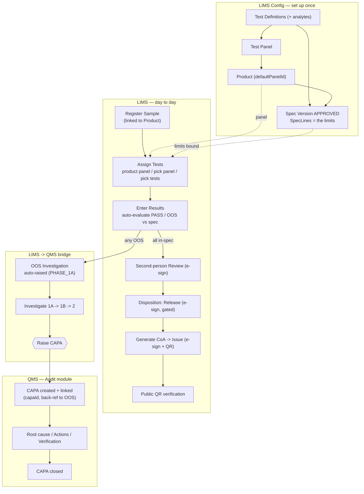

# LIMS ↔ QMS Flow & Change Log

> Date: 2026-06-27 · Branch: `shriyansh-phase-implemenation`
> Companion to `docs/LIMS-flow-verification-and-fixes.md` (the original gap analysis).
> Contains: (1) the working flow diagram, (2) how to test it, (3) a log of every
> change made.

---

## 1. Flow diagram



If your viewer doesn't render Mermaid, here is the same flow in plain text:

```
LIMS CONFIG (once):
  Test Definitions (+analytes) -> Test Panel -> Product.defaultPanel
  Test Definitions + Product   -> Spec Version (APPROVED) -> SpecLines (limits)

LIMS RUNTIME:
  Register Sample (+Product)
        |
        v
  Assign Tests  ──(panel from product, limits from spec version)
        |
        v
  Enter Results ──auto PASS/OOS vs spec──┐
        |                                │
   all in-spec                       any OOS
        |                                │
        v                                v
  Review (e-sign)               OOS Investigation (auto, LIMS)
        |                                │
        v                          Investigate 1A->1B->2
  Release (e-sign, gated)               │
        |                          Raise CAPA  ─────────────► QMS
        v                                                      │
  Generate CoA -> Issue (e-sign+QR) -> Public verify     CAPA (root cause,
                                                          actions, verify, close)
```

**The bridge:** an out-of-spec result auto-raises an **OOS investigation** (LIMS);
"Raise CAPA" on that investigation creates and links a **CAPA** in the QMS/Audit
module (`OosInvestigation.capaId`), with the CAPA description back-referencing the
OOS code.

---

## 2. How to test the flow

**0. Start the app** (root): `npm run dev` → backend `:4000`, client `:5173`.
Login: **info@forgequantumsolution.com** / **Admin@123**.
Seeded already: 4 samples, products+panels, approved spec versions, and
SMP-2026-0001 mid-testing with a live OOS + linked CAPA.

### Test A — see the bridge (seeded, fastest)
1. LIMS → **Samples** → open **SMP-2026-0001**.
2. *Tests & Results*: **Related Substances = 0.8** is flagged **OOS** (limit ≤ 0.5).
3. LIMS → **OOS** → open **OOS-2026-0001** → click the **Linked CAPA** chip → it
   opens the CAPA in the **Audit/QMS** module. ✅

### Test B — raise a new OOS → CAPA
1. Samples → **SMP-2026-0002** (Amoxicillin) → **Start Testing**.
2. **Assign Tests** → "Product panel" → **Assign** (tests show spec limits).
3. On **Assay**, enter an out-of-range value (e.g. **130**, limit 90–120) →
   **Save Results** → flags **OOS**.
4. LIMS → **OOS** → the new investigation was **auto-raised**. Open it →
   **Raise CAPA** → fill title/type → **Raise & link**.
5. The **Linked CAPA** chip appears and opens the new CAPA in the QMS module. ✅

### Test C — clean happy path → CoA
1. Samples → **Register Sample** → Product = **Paracetamol** (name auto-fills) → Register.
2. **Start Testing** → **Assign Tests** (product panel) → enter **in-spec** values
   for all analytes → **Save Results** (all PASS).
3. **Send to Review** → on each test **Review** → enter password (e-sign) → **Approve**.
4. *Disposition* → **Release** (now enabled) → e-sign → sample RELEASED.
5. Header **Generate CoA** → **Issue** (e-sign) → open the **QR verify** link →
   `valid: true`. ✅

### Pass criteria
- Assign returns a bound `spec_version`; result rows show **Spec Limit** values.
- Out-of-spec value → **OOS** badge **and** a new LIMS → OOS row.
- "Raise CAPA" creates **CAPA-YYYY-NNNN**; OOS shows the linked chip; the CAPA
  description reads *"Raised from OOS investigation OOS-…"*.
- **Release is blocked** until all tests are review-approved with no OOS.
- CoA QR verifies live.

---

## 3. Change log (this session)

All changes are in the working tree only — **nothing was committed**.

### 3.1 Make the core LIMS flow reachable

**C1 — link Sample → Product** (sample registration previously only stored a
free-text product name, so `productId` was always null and assign could never
resolve a panel/spec).
- `backend/src/modules/sample/sample.schema.ts` — `product_id` added to register/update.
- `backend/src/modules/sample/sample.service.ts` — register/update set `productId`
  and denormalise `productName` from the linked product; serializer exposes `product_id`.
- `client/src/lib/api/samples.ts` — `product_id` on `SampleSummary` + `RegisterSampleBody`.
- `client/src/features/lims/SampleListPage.tsx` — Product master picker on registration.

**C2 — link Product → default Test Panel** (column existed, upsert never set it).
- `backend/src/modules/lims-master/product.schema.ts` — `default_panel_id` added.
- `backend/src/modules/lims-master/product.service.ts` — create/update/serializer wired.
- `client/src/lib/api/product.ts` — `default_panel_id` on `Product` + `ProductUpsert`.
- `client/src/features/lims/ProductsPage.tsx` — Default Test Panel selector.

**C3 — Assign Tests modal: three modes** (was a single, always-failing "from product").
- `client/src/features/lims/SampleTestsPanel.tsx` — modes: product panel / pick a
  panel / pick tests (sends `from_product` | `panel_id` | `test_definition_ids`).

### 3.2 Reconcile & polish

**H1 — single, gated release path** (header enum and the e-signed disposition both
offered Release, on any status).
- `client/src/features/lims/SampleDetailPage.tsx` — header enum no longer offers
  Release/Reject (lifecycle progression only); passes `status` to the panel.
- `client/src/features/lims/SampleTestsPanel.tsx` — disposition section only shows
  once tests exist; **Release** enabled only when in-review + all approved + no OOS.

**M1 — CoA generation entry points.**
- `client/src/features/lims/SampleDetailPage.tsx` — **Generate CoA** button on
  released samples.
- `client/src/features/lims/CoaListPage.tsx` — Generate modal uses a **sample picker**
  instead of a raw UUID field.

### 3.3 Demo data & users

**C5 — extend the LIMS seed.**
- `backend/prisma/seed-lims-data.ts` — seeds Test Definitions, Test Panels, Products
  (with `defaultPanelId`), approved Spec Versions (+ lines), links the 4 samples to
  products + spec versions (backfilling existing rows), and pre-assigns the
  Paracetamol panel to SMP-2026-0001 with one **OOS** result + investigation.

**H2 — reviewer account.**
- `backend/prisma/seed.ts` — added `reviewer@forgequantum.com` (QC Reviewer) so the
  analyst ≠ reviewer second-person review is demonstrable.

### 3.4 Bug fix found during verification

**Transaction timeout** — once panels with multiple tests/analytes were actually
assigned, `assignTests`/`enterResults` exceeded Prisma's default 5 s interactive
transaction window against the remote DB (HTTP 500 "Transaction already closed").
- `backend/src/modules/sample-testing/sample-testing.service.ts` — both
  `$transaction` calls given `{ timeout: 30_000, maxWait: 10_000 }`.

### 3.5 LIMS → QMS bridge: OOS → CAPA (new feature)

**Backend**
- `backend/src/modules/oos/oos.schema.ts` — `CreateCapaFromOosSchema`.
- `backend/src/modules/oos/oos.service.ts` — `createCapaForInvestigation()` (creates a
  QMS CAPA via `audit/capa.service`, links `capaId`, moves OOS → IN_PROGRESS, 409 if
  already linked); `getInvestigation()` enriched with the linked CAPA `{id, capa_number, status}`.
- `backend/src/modules/oos/oos.controller.ts` — `createCapa` handler.
- `backend/src/modules/oos/oos.routes.ts` — `POST /api/oos/:id/capa` (perm `capa.create`).

**Frontend**
- `client/src/lib/api/oos.ts` — `capa` field on `Investigation`; `useCreateCapaFromOos`.
- `client/src/features/lims/OosDetailPage.tsx` — **Raise CAPA** action (prefilled
  from the OOS), clickable **Linked CAPA** chip → `/audit/capa/:id`, and the close
  modal's free-text CAPA id replaced with a **picker of existing CAPAs**.

### 3.6 Analyst worksheet — make test execution self-explanatory (2026-06-27)

Feedback: after assigning, the grid just asked for values with no context ("where
do the tests run?"). A LIMS records analyst-measured values (it doesn't generate
them), but the UI didn't say so. Added four things:

**Backend**
- `backend/src/modules/sample-testing/sample-testing.service.ts` — test serializer
  now includes `technique`, `method_name`, `sop_ref`, `guidance`, `instrument_name`
  (from the linked Test Definition / Method / instrument); shared `testInclude` used
  by all read paths. New `startTest()` (PENDING → IN_PROGRESS, stamps analyst +
  startedAt; 400 if already started).
- `sample-testing.schema.ts` / `.controller.ts` / `.routes.ts` — `StartTestSchema` +
  `POST /api/testing/tests/:id/start` (perm `result.enter`).

**Frontend**
- `client/src/lib/api/testing.ts` — method fields on `SampleTest`; `useStartTest`;
  `acceptanceText()` (criteria in words) and `previewEvaluation()` (live PASS/OOS).
- `client/src/features/lims/SampleTestsPanel.tsx`:
  1. **Method context** per card — technique · method (SOP) · instrument, plus a
     guidance/hint line and an **Acceptance** column in words ("95 – 105 %").
  2. **Start Test** step — a PENDING test shows "Start Test"; the result grid is
     locked until started, with a "Not started…" hint.
  3. **Import CSV** — fill the grid from an `Analyte,Value` file (instrument-style
     import); values land as unsaved edits to review then Save.
  4. **Live OOS preview** — as you type, an out-of-range value turns the input red
     with "⚠ Out of spec — will raise an investigation" and a dashed "OOS ?" badge,
     before you even save.

Verified (API + Playwright): method context/SOP render, Start transitions
PENDING→IN_PROGRESS (re-start → 400), Import CSV + Save buttons appear, and typing
`130` against a 95–105 limit shows the live OOS preview. `tsc` clean both sides.

### 3.6b Bug fix — CAPA detail page stuck loading (pre-existing)

Clicking the linked-CAPA chip opened `/audit/capa/:id`, which hung on a spinner.
Cause: `GET /api/audit/capas/:id` returns the **bare** CAPA object, but `useCapa`
was typed `{ data: Capa }` and `CapaDetailPage` read `const c = data?.data` →
always `undefined` → `isLoading || !c` stays true forever. The page was simply
never reachable before (no CAPAs existed until the OOS→CAPA bridge created one).
- `client/src/lib/api/audit.ts` — `useCapa` now typed `useQuery<Capa>`.
- `client/src/features/audit/CapaDetailPage.tsx` — `const c = data` (not `data?.data`).
Verified: the CAPA detail page loads with the pipeline, tabs, and the OOS back-reference.

### 3.7 Docs added
- `docs/LIMS-flow-verification-and-fixes.md` — original gap analysis + applied-fix log.
- `docs/LIMS-QMS-flow-and-changes.md` — this file.

### 3.7 Verification performed
- Both workspaces `tsc --noEmit` clean.
- API end-to-end: register-with-product → assign (all 3 modes, spec bound) → enter
  results → **OOS auto-raised** → review → release → **CoA generate/issue/QR verify**.
- OOS → CAPA: `POST /oos/:id/capa` → 201 (CAPA created + linked, OOS → IN_PROGRESS),
  duplicate → 409, QMS CAPA carries the OOS back-reference.
- Playwright UI: assign modal modes, OOS list, linked-CAPA chip, close-modal picker,
  Generate CoA button — no API errors.
- Demo DB left clean: 4 samples / 4 products / 3 panels / 3 approved spec versions;
  SMP-2026-0001 with a live OOS linked to CAPA-2026-0004.

> Reminder: per project rule, these changes are **not committed** — they live in the
> working tree for you to review and commit yourself.
