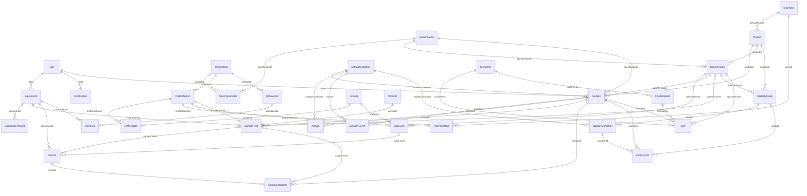

# LIMS Data Model & Entity Relationships

> Status: current as of migration `20260625121516_lims_relations_fks` (2026-06-25).
> This documents every LIMS entity, the **foreign-key relationships** between them
> (now enforced in the database), the `onDelete` behaviour, and the deliberate
> "soft-link" references that remain plain ids.

Before this migration, most cross-module references were **plain id columns** (no
FK) so each module's migration stayed self-contained. They are now **real Prisma
relations / database foreign keys** — 45 FK constraints across the LIMS tables —
so the data graph is navigable (`include`), referentially safe, and
self-documenting. The scalar id columns are retained as the FK columns, so all
existing service code keeps working unchanged.

---

## 1. Entity catalogue (by domain)

### Configuration / master data (set up once)
| Entity | Purpose | Key fields |
|---|---|---|
| `Lab` | Internal / partner / contract labs | code, type, gmpClass, accreditation |
| `Equipment` | Instruments | code, category, status, calibrationDueAt |
| `CalibrationRecord` | Calibration history for an instrument | result, calibratedAt, nextDueAt |
| `Certification` | Lab certifications (GMP/NABL/ISO/USFDA) | type, expiryDate |
| `StorageLocation` | Freezers / fridges / chambers / cabinets | code, tempZone |
| `TestMethod` | Analytical methods | code, technique, sopRef |
| `Specification` | Legacy spec library (+ `SpecParameter`) | code, status, parameters |
| `Product` | Products / materials (+ `defaultPanel`) | code, grade, dosageForm |
| `Analyte` | Components measured | code, defaultUnit, dataType |
| `UnitOfMeasure` | Units catalogue | code, symbol, kind |
| `SamplingPoint` | Sampling locations | code, area |
| `Customer` / `Supplier` | Trading partners | code, country |
| `TestDefinition` | Configurable test (+ `TestAnalyte` rows) | code, status, analytes |
| `TestPanel` | Group of tests (+ `TestPanelItem`) | code, items |
| `SpecVersion` | Versioned, multi-stage specs (+ `SpecLine`) | stage, status, lines |

### Operations (day to day)
| Entity | Purpose |
|---|---|
| `Sample` (+ `CustodyEvent`, `Aliquot`) | Registered sample, chain of custody, aliquots |
| `SampleTest` (+ `Result`) | A test assigned to a sample, with per-analyte results |
| `Worklist` | Batch/run grouping of `SampleTest`s |
| `OosInvestigation` | OOS/OOT investigation raised from a failing result |
| `QcMaterial` (+ `QcResult`) | QC control material + Levey-Jennings points |
| `StabilityStudy` (+ `StabilityCondition`, `StabilityPull`) | ICH stability study, schedule, pulls |
| `CoaTemplate` / `Coa` | Certificate templates + issued certificates |

---

## 2. Relationship diagram



---

## 3. Relationship reference (with delete behaviour)

`Cascade` = deleting the parent deletes children. `SetNull` = deleting the parent
nulls the reference. `Restrict` = parent cannot be deleted while referenced.
(Most master data is **soft-deleted** via `isDeleted`, so hard deletes are rare;
the `onDelete` rule is the safety net.)

| Parent | → Child (field) | Cardinality | onDelete |
|---|---|---|---|
| Lab | Equipment (`labId`) | 1—* | SetNull |
| Lab | Certification (`labId`) | 1—* | SetNull |
| Lab | Sample (`labId`) | 1—* | SetNull |
| Equipment | CalibrationRecord (`equipmentId`) | 1—* | Cascade |
| Equipment | SampleTest (`instrumentId`) | 1—* | SetNull |
| Equipment | Result (`instrumentId`) | 1—* | SetNull |
| Equipment | QcResult (`instrumentId`) | 1—* | SetNull |
| TestMethod | SpecParameter (`methodId`) | 1—* | SetNull |
| TestMethod | TestDefinition (`methodId`) | 1—* | SetNull |
| TestMethod | QcMaterial (`methodId`) | 1—* | SetNull |
| Specification | SpecParameter (`specificationId`) | 1—* | Cascade |
| Specification | SpecVersion (`specificationId`) | 1—* | SetNull |
| Specification | Sample (`specificationId`) | 1—* | SetNull |
| Product | Sample (`productId`) | 1—* | SetNull |
| Product | SpecVersion (`productId`) | 1—* | SetNull |
| Product | StabilityStudy (`productId`) | 1—* | SetNull |
| TestPanel | Product (`defaultPanelId`) | 1—* | SetNull |
| TestPanel | TestPanelItem (`panelId`) | 1—* | Cascade |
| Analyte | TestAnalyte (`analyteId`) | 1—* | SetNull |
| Analyte | SpecLine (`analyteId`) | 1—* | SetNull |
| TestDefinition | TestAnalyte (`testDefinitionId`) | 1—* | Cascade |
| TestDefinition | TestPanelItem (`testDefinitionId`) | 1—* | Cascade |
| TestDefinition | SpecLine (`testDefinitionId`) | 1—* | SetNull |
| TestDefinition | SampleTest (`testDefinitionId`) | 1—* | **Restrict** |
| SpecVersion | SpecLine (`specVersionId`) | 1—* | Cascade |
| SpecVersion | Sample (`specVersionId`) | 1—* | SetNull |
| SpecVersion | SampleTest (`specVersionId`) | 1—* | SetNull |
| SpecVersion | StabilityStudy (`specVersionId`) | 1—* | SetNull |
| SpecVersion | Coa (`specVersionId`) | 1—* | SetNull |
| SpecLine | Result (`specLineId`) | 1—* | SetNull |
| StorageLocation | Sample (`currentLocationId`) | 1—* | SetNull |
| StorageLocation | Aliquot (`storageLocationId`) | 1—* | SetNull |
| StorageLocation | CustodyEvent (`fromLocationId`, rel `CustodyFrom`) | 1—* | SetNull |
| StorageLocation | CustodyEvent (`toLocationId`, rel `CustodyTo`) | 1—* | SetNull |
| StorageLocation | StabilityCondition (`storageLocationId`) | 1—* | SetNull |
| Sample | CustodyEvent (`sampleId`) | 1—* | Cascade |
| Sample | Aliquot (`sampleId`) | 1—* | Cascade |
| Sample | SampleTest (`sampleId`) | 1—* | Cascade |
| Sample | OosInvestigation (`sampleId`) | 1—* | SetNull |
| Sample | StabilityPull (`sampleId`) | 1—* | SetNull |
| Sample | Coa (`sampleId`) | 1—* | SetNull |
| Worklist | SampleTest (`worklistId`) | 1—* | SetNull |
| SampleTest | Result (`sampleTestId`) | 1—* | Cascade |
| SampleTest | OosInvestigation (`sampleTestId`) | 1—* | SetNull |
| Result | OosInvestigation (`resultId`) | 1—* | SetNull |
| QcMaterial | QcResult (`qcMaterialId`) | 1—* | Cascade |
| StabilityStudy | StabilityCondition (`studyId`) | 1—* | Cascade |
| StabilityStudy | StabilityPull (`studyId`) | 1—* | Cascade |
| StabilityCondition | StabilityPull (`conditionId`) | 1—* | SetNull |
| Customer | Coa (`customerId`) | 1—* | SetNull |
| Customer | CoaTemplate (`customerId`) | 1—* | SetNull |
| CoaTemplate | Coa (`templateId`) | 1—* | SetNull |

> Two relations from **CustodyEvent** target the same `StorageLocation`, so they
> use **named relations** (`CustodyFrom` / `CustodyTo`) on both sides.

---

## 4. Deliberate soft-links (still plain ids — NOT foreign keys)

These remain plain id columns on purpose, to avoid hard-coupling LIMS to other
domains (or to a shared actor table). They are validated in service logic, not by
the database.

| Field | Points at | Why kept soft |
|---|---|---|
| `OosInvestigation.capaId` | `Capa` (CAPA module) | Cross-domain link into QMS; keeps LIMS migrations independent of the audit/CAPA schema |
| `TestMethod.documentId` | `Document` (DMS) | Optional reference to a controlled SOP |
| `Specification.isoStandardId` | `IsoStandard` (Audit) | Optional standard reference |
| `*.createdById`, `approvedById`, `reviewedById`, `releasedById`, `openedById`, `closedById`, `handledById`, `enteredById`, `analystId` | `User` | Actor stamps are intentionally plain across the whole platform |

If/when these should become enforced FKs, the same pattern applies: confirm zero
orphans, add the relation on both sides, migrate.

---

## 5. Denormalised / snapshot fields (intentional, not a missing relation)

For **GxP traceability**, several records snapshot values at a point in time so
later master-data edits never alter historical records:

- `SampleTest.testName` — the test definition's name at assignment time.
- `Result.minValue` / `maxValue` / `decimals` — the spec limits **as evaluated**,
  copied from the bound `SpecLine` (so re-approving a spec can't retro-change a verdict).
- `Result.analyteName`, `StabilityPull.conditionName`, `Coa.productName` — display
  labels captured alongside the FK.
- `Coa.resultsJson` — the full results snapshot frozen into the certificate at issue.
- `QcResult.zScore` / `violatedRules` — computed at record time against the material's
  established mean/SD.

These coexist with the FK relations: the relation gives you the live parent, the
snapshot preserves what was true historically.

---

## 6. Working with the relations in code

The scalar FK columns are unchanged, so existing writes still work. Reads can now
traverse the graph:

```ts
// A sample with its master-data context + tests + results, in one query.
const sample = await prisma.sample.findUnique({
  where: { id },
  include: {
    lab: true,
    product: true,
    specVersion: { include: { lines: true } },
    currentLocation: true,
    custodyEvents: { include: { fromLocation: true, toLocation: true } },
    aliquots: { include: { storageLocation: true } },
    sampleTests: { include: { testDefinition: true, instrument: true, results: { include: { specLine: true } } } },
    coas: true,
  },
});
```
