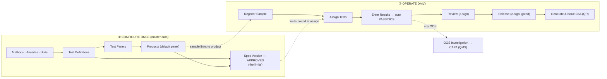
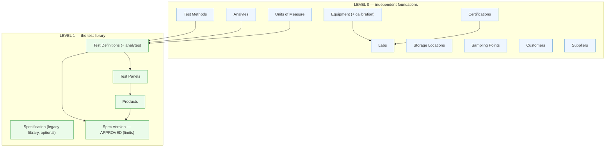
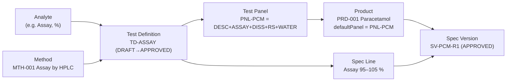
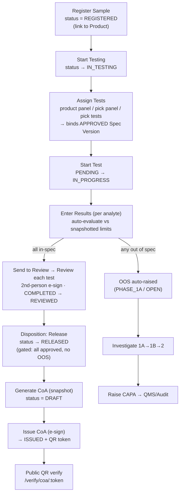
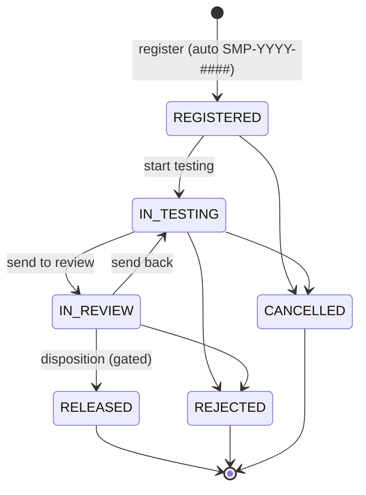
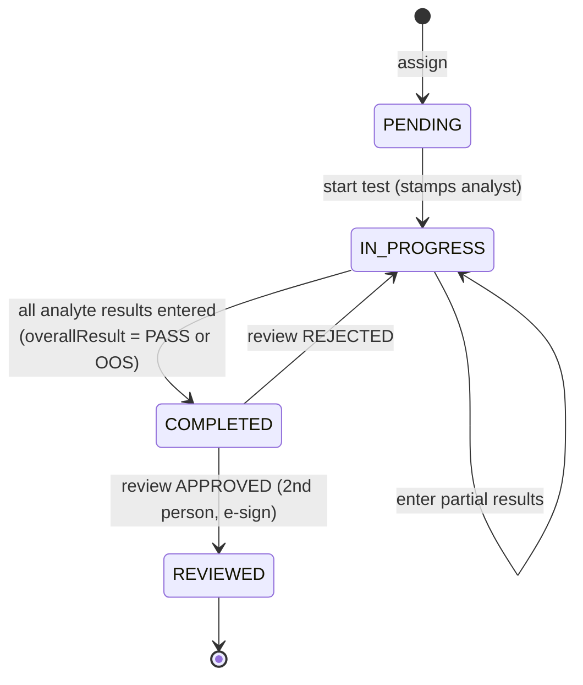
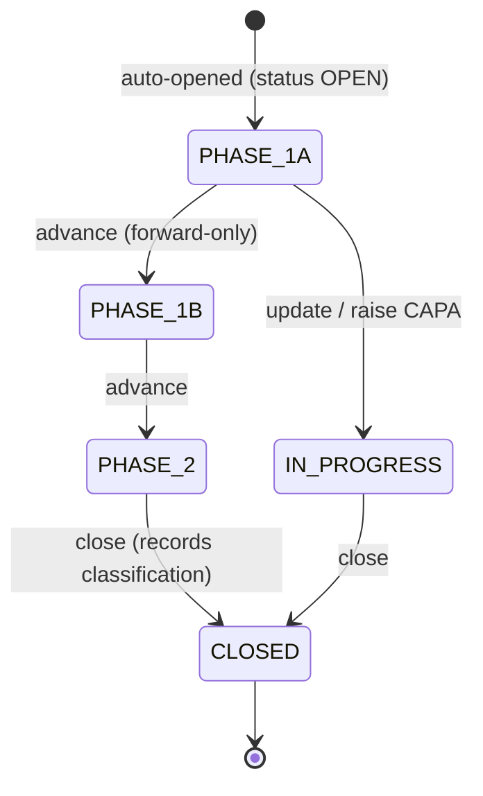
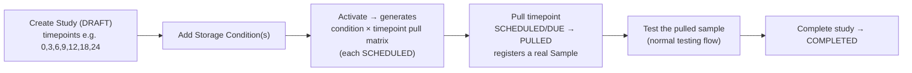
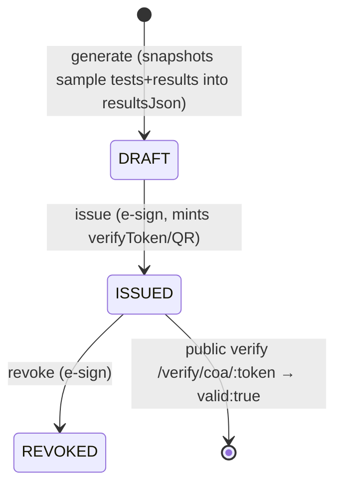

# LIMS Module — How It Works & What to Configure First

> A practical, end-to-end guide to the LIMS (Laboratory Information Management
> System) module: the big picture, the **master data you must set up first**
> (in order), and the **day-to-day operational flow** from registering a sample
> to issuing a QR-verifiable Certificate of Analysis.
>
> **New to the data connections?** Jump to [§1.1 "What connects to what"](#11-what-connects-to-what-data-flow-map)
> for a map of which master-data table feeds which operational field.
>
> Companion docs: [`LIMS-data-model.md`](./LIMS-data-model.md) (entities + FKs),
> [`LIMS-QMS-flow-and-changes.md`](./LIMS-QMS-flow-and-changes.md) (OOS→CAPA bridge),
> [`LIMS-industrial-upgrade-plan.md`](./LIMS-industrial-upgrade-plan.md) §I (the 2026-07-04
> wiring that connected the master-data "islands" reflected throughout this guide).

---

## 1. The 60-second mental model

LIMS has **two layers**:

| Layer | What it is | When you touch it | Where in the UI |
|---|---|---|---|
| **Configuration** (master data) | The lab's "dictionary" — labs, instruments, methods, products, analytes, tests, panels, specs | **Set up once**, then edit rarely | `LIMS → Configuration` (`/lims/config`) |
| **Operations** (runtime) | The day-to-day: samples, tests, results, investigations, certificates | Every day | `LIMS → Samples / Worklists / OOS / QC / Stability / CoA` |

The golden rule: **you cannot run a sample until its master data exists.** A sample
points at a *Product*; the product carries a *Test Panel*; the panel bundles *Test
Definitions*; and an **APPROVED Spec Version** supplies the *pass/fail limits*. If any
link in that chain is missing, "Assign Tests" has nothing to resolve.



---

## 1.1 What connects to what (data-flow map)

Every master-data table feeds a specific field somewhere in operations. This map shows
**where each thing you configure actually shows up** — so you know why you're filling it in.
(Connections marked ✅ **new (2026-07-04)** were just wired; before that those masters were
"islands" you could fill but nothing read.)

```mermaid
flowchart LR
    classDef m fill:#eef6ff,stroke:#4a90d9;
    classDef o fill:#fff5e6,stroke:#d98a00;

    UN["Units of Measure"]:::m -->|✅ unit dropdown| UF["Spec lines · Test defs · Sample qty · QC · Aliquots"]:::o
    AN["Analytes"]:::m -->|name + default unit| TDf["Test Definitions · Spec lines"]:::o
    MT["Test Methods"]:::m --> TDf
    PR["Products"]:::m -->|register picker| SMP["Sample"]:::o
    PN["Test Panels"]:::m -->|product default / assign| AT2["Assign Tests"]:::o
    ST2["Storage Locations"]:::m --> CUS2["Sample custody · Aliquots · Stability"]:::o
    CU["Customers"]:::m -->|✅ register picker| SMP
    CU -->|✅ generate picker + prints on cert| COA2["Certificate of Analysis"]:::o
    SU["Suppliers"]:::m -->|✅ register picker (Raw Material)| SMP
    SPt["Sampling Points"]:::m -->|✅ register picker| SMP
    CT["CoA Templates"]:::m -->|✅ header/footer/sections render| COA2
    LB["Labs"]:::m --> EQC["Equipment · Certifications · Samples"]:::o
```

**In words — what feeds each operational field:**

| When you… | you pick from this master | filled in at |
|---|---|---|
| enter any unit | **Units of Measure** (dropdown, free-text still allowed) | spec lines, test defs, sample qty, QC, aliquots |
| register a sample | **Product** (required-ish), **Customer**, **Sampling Point**, **Supplier** (only if Type = Raw Material), **Lab**, **Storage** | Register drawer |
| assign tests | **Test Panel** / **Test Definitions** (+ the product's default panel) | Assign Tests modal |
| generate a CoA | **Sample**, **CoA Template**, **Customer** | Generate CoA modal |
| build a test | **Analyte** + **Method** | Test Definition editor |

> Still display-only: **Certifications** and **Equipment/calibration** are tracked but not
> yet surfaced in the operational flow (a future enhancement — see the plan's §I).

---

## 2. What you must configure first — the build order

Set the master data up in this dependency order. Everything on a given level only
needs the levels above it. (The demo seed [`backend/prisma/seed-lims-data.ts`](../backend/prisma/seed-lims-data.ts)
creates exactly this graph — a great worked example.)



### Level 0 — foundations (any order among themselves)

| # | Configure | Page (route) | API | What to fill in | Needed for |
|---|---|---|---|---|---|
| 1 | **Labs** | Lab Registry `/lims/labs` | `/api/lims` | code, name, type (`INTERNAL`/`PARTNER`/`CONTRACT`), GMP class, accreditation | Equipment, Certifications, Samples |
| 2 | **Equipment** | Equipment `/lims/equipment` | `/api/lims` | code, category, lab, serial, calibration frequency + last-cal date | Instrument stamp on results, QC |
| 3 | **Storage Locations** | Storage `/lims/storage` | `/api/samples/storage-locations` | code, type (Freezer/Chamber…), temp zone | Sample custody, aliquots, stability |
| 4 | **Certifications** | Certifications `/lims/certifications` | `/api/lims` | type (GMP/NABL/ISO/USFDA), number, lab, expiry | Lab compliance tracking (display-only) |
| 5 | **Test Methods** | Test Methods `/lims/methods` | `/api/lims` | code, name, technique (HPLC/Titration/Visual…), SOP ref, default unit | Test Definitions, Specs |
| 6 | **Analytes** | Analytes `/lims/analytes` | `/api/lims-master` | code, name, default unit, data type (`NUMERIC`/`TEXT`) | Test Definitions, Spec lines |
| 7 | **Units of Measure** | Units `/lims/units` | `/api/lims-master` | code, name, symbol, kind | **Unit dropdown** on spec lines, test defs, sample qty, QC, aliquots |
| 8 | **Sampling Points** | Sampling Points `/lims/sampling-points` | `/api/lims-master` | code, name, area | **Sampling-Point picker** on sample registration (where drawn) |
| 9 | **Customers** | Customers `/lims/customers` | `/api/lims-master` | code, name, country, contact | **Customer picker** on sample registration **and** CoA generate (prints on the certificate) |
| 10 | **Suppliers** | Vendor Mgmt `/lims/suppliers` | `/api/lims-master` | code, name, country, contact | **Supplier picker** on sample registration (shown when Type = Raw Material) |

### Level 1 — the test library (this is the important part)

This is where the "what does it mean to test this product" is defined. **Order matters here.**



| Step | Configure | Page (route) | API | Lifecycle | Notes |
|---|---|---|---|---|---|
| 11 | **Test Definition** (+ ordered analytes) | Test Definitions `/lims/tests` | `/api/test-definitions` | `DRAFT → APPROVED` (must **Approve**) | One reusable analytical test. Editable only while DRAFT. Needs ≥1 analyte to approve. |
| 12 | **Test Panel** | Test Panels `/lims/panels` | `/api/test-definitions/panels` | — | An ordered bundle of Test Definitions (the "release panel" for a product). |
| 13 | **Product** | Products `/lims/products` | `/api/lims-master` | — | Set **Default Test Panel** so samples auto-assign. |
| 14 | **Specification** (legacy library) | Specifications `/lims/specifications` | `/api/lims` | `DRAFT → APPROVED → RETIRED` | Optional older spec store; the runtime authority is **Spec Version** below. |
| 15 | **Spec Version** (+ spec lines) | Spec Versions `/lims/spec-versions` | `/api/spec-versions` | `DRAFT → APPROVED` (→ `SUPERSEDED`/`RETIRED`) | **The limit authority.** Each line = one analyte's min/max/target/text criteria + decimals. **Must be APPROVED** to be used. Approving a new version auto-supersedes the prior APPROVED one for the same product/stage. |

> **Why two "spec" things?** `Specification` is the older flat library (`SpecParameter`
> rows). `SpecVersion` (with `SpecLine` rows) is the **versioned, multi-stage** authority
> the testing engine actually binds — chosen as the newest `APPROVED` version for the
> product, preferring `stage = RELEASE`. Configure the **Spec Version**; the Specification
> library is optional/legacy.

### The minimal setup to run ONE sample end-to-end

If you just want the happy path working for a single product:

1. **Method** (e.g. "Assay by HPLC")
2. **Analyte** (e.g. "Assay", %, NUMERIC)
3. **Test Definition** "Assay" → link method + analyte → **Approve**
4. **Test Panel** "Release Panel" → add the Test Definition
5. **Product** → set its **Default Test Panel** to that panel
6. **Spec Version** for that product → add a Spec Line (Assay 95–105 %) → **Approve**
7. (Optional but recommended) a **Lab** and a **Storage Location**

Now the operational flow in §3 is fully reachable.

---

## 3. The operational flow (day to day)

### 3.1 End-to-end runtime pipeline



### 3.2 Sample lifecycle (state machine)

`SampleStatus`: transitions are enforced server-side (`sample.service.ts` `ALLOWED` map).



- **What registration captures** (Register drawer): Product (auto-fills name + attaches its panel/spec), plus optional **Customer**, **Sampling Point**, **Supplier** (shown only when Type = `Raw Material`), Lab, Priority, Quantity + **Unit** (from the Units catalog), dates, Source Site and Initial Storage. Only the product/material name is strictly required; the rest degrade gracefully. The linked Customer/Supplier/Sampling-Point then show on the sample detail header and flow into the CoA.
- A **`REGISTERED` custody event** is auto-created on registration.
- **Custody** (`CustodyAction`: REGISTERED, RECEIVED, TRANSFERRED, STORED, ALIQUOTED, RETURNED, DISPOSED) is append-only; a TRANSFERRED/STORED/RETURNED with a `to_location` also moves the sample's current location.
- **Deleting a sample** is allowed only while `REGISTERED` (soft-delete, gated `sample.update`) — a Delete button on the detail header.
- **Aliquots** create a child sample portion + an `ALIQUOTED` custody event.
- A RELEASED/REJECTED sample can no longer be edited; disposition is **driven from the testing panel**, not the sample header.

### 3.3 Test execution & result evaluation (state machine)

`SampleTest.status`: `PENDING → IN_PROGRESS → COMPLETED → REVIEWED` (+ `CANCELLED`).



**How a result is judged** (`enterResults` → `evaluateValue`):
1. At **assign**, each analyte's `Result` row is pre-created, **snapshotting** the
   min/max/decimals from the matching `SpecLine` (matched by analyte name). This snapshot
   is why re-approving a spec later can never retroactively change an old verdict.
2. On **enter**, the numeric value is rounded to `decimals`, then compared to the
   snapshotted min/max:
   - out of range → `evaluation = OOS`, `isOutOfSpec = true`
   - in range → `PASS`
   - text-only criteria → `NA`; empty → `PENDING`
3. When **every** result is entered → test `COMPLETED`, `overallResult = OOS if any breach else PASS`.
4. **Any OOS → an OOS Investigation is auto-opened** for the first breach.

**Review is second-person:** the analyst who entered results **cannot** review them.
Only `COMPLETED` tests can be approved. **Release is gated**: it requires the sample to
have tests, **all** tests `reviewStatus = APPROVED`, and **no** test in `OOS`/`FAIL`.

### 3.4 Spec Version lifecycle

```mermaid
stateDiagram-v2
    [*] --> DRAFT: create (version 1, with lines)
    DRAFT --> APPROVED: approve (needs >=1 line;<br/>supersedes prior APPROVED for same product/stage)
    APPROVED --> SUPERSEDED: a newer version is approved
    APPROVED --> DRAFT: revise (clones lines to version+1)
    APPROVED --> RETIRED
```



---

## 4. The LIMS → QMS bridge: OOS → CAPA

An out-of-spec result auto-raises an **OOS Investigation** (still inside LIMS). Working
it can escalate into the QMS/Audit module as a **CAPA**.



- **Phases** (`PHASE_1A → PHASE_1B → PHASE_2 → CLOSED`) advance forward-only; **status** is `OPEN → IN_PROGRESS → CLOSED`.
- **Raise CAPA** (`POST /api/oos/:id/capa`) creates **both** a standalone CAPA record *and* a ticket on the active **CAPA workflow** (prefilling its initiation form from the OOS), links both, and moves the OOS to `IN_PROGRESS`.
- **Close** records a `classification`: `LAB_ERROR` / `NON_LAB_ERROR` / `CONFIRMED_OOS` / `INVALIDATED`.

See [`LIMS-QMS-flow-and-changes.md`](./LIMS-QMS-flow-and-changes.md) for the full bridge design.

---

## 5. Side flows (independent of the sample pipeline)

### 5.1 QC — Levey-Jennings / Westgard (`/lims/qc`, `/api/qc`)

1. Create a **QC Material** with an established `targetMean` + `targetSd` (SD must be > 0).
2. Record results → each computes a **z-score** and runs the **Westgard multirule** set
   (`1-3s`, `1-2s` warn, `2-2s`, `R-4s`, `4-1s`, `10x`) over the last 12 points →
   status `ACCEPT` / `WARN` / `REJECT`.
3. The chart endpoint returns Levey-Jennings control lines (mean ±1/2/3 SD) + points.

No approval workflow — each QC result stands alone.

### 5.2 Stability — ICH Q1A (`/lims/stability`, `/api/stability`)



- `StabilityStudy`: `DRAFT → ACTIVE → COMPLETED` (+ `CANCELLED`). `StabilityPull`: `SCHEDULED → DUE → PULLED → TESTED` (+ `SKIPPED`).
- A cron sweep flips past-due `SCHEDULED → DUE` automatically.
- **Pulling a timepoint registers a real Sample** (type `Stability`) — it then flows through the standard testing pipeline in §3.

### 5.3 Certificate of Analysis (`/lims/coa`, `/api/coa`)



- **Generate** (Generate CoA modal) picks a **Sample**, optionally a **CoA Template** and a
  **Customer** (a template pre-fills its default customer). It snapshots the sample's tests +
  results (product, batch, spec version) into the certificate so later edits can't change an
  issued cert.
- **Templates drive the certificate** (`/lims/coa` → Templates): a template sets the
  **Title**, an ordered list of **Sections** (description, results, conclusion, signatures),
  and optional **Header HTML** / **Footer HTML** (sanitized on render) + a default Customer.
  The CoA detail page renders exactly what the template specifies (falling back to a default
  layout when no template is chosen); the picked Customer prints on the certificate.
- **Issue** mints a `verifyToken` powering the public **QR verification** page
  (`/verify/coa/:token`, no auth) — `valid: true` only while `ISSUED`. (The public page shows
  only product/batch/status/conclusion — not the template HTML.)

**Configure a CoA template first** if you want branded certificates: `/lims/coa` → **Templates**
→ New Template → set Name, Title, Sections, optional Customer + Header/Footer HTML.

---

## 6. Reference tables

### 6.1 Status / phase enums (exact values)

| Entity | Field | Values |
|---|---|---|
| Sample | status | `REGISTERED` `IN_TESTING` `IN_REVIEW` `RELEASED` `REJECTED` `CANCELLED` |
| Sample | disposition | `RELEASED` `REJECTED` |
| CustodyEvent | action | `REGISTERED` `RECEIVED` `TRANSFERRED` `STORED` `ALIQUOTED` `RETURNED` `DISPOSED` |
| SampleTest | status | `PENDING` `IN_PROGRESS` `COMPLETED` `REVIEWED` `CANCELLED` |
| SampleTest | overallResult | `PASS` `FAIL` `OOS` |
| SampleTest | reviewStatus | `PENDING` `APPROVED` `REJECTED` |
| Result | evaluation | `PENDING` `PASS` `OOS` `OOT` `NA` |
| Worklist | status | `OPEN` `IN_PROGRESS` `CLOSED` |
| TestDefinition | status | `DRAFT` `APPROVED` `RETIRED` |
| SpecVersion | status / stage | `DRAFT` `APPROVED` `SUPERSEDED` `RETIRED` / `RELEASE` `STABILITY` `IN_PROCESS` `RAW_MATERIAL` |
| Specification (legacy) | status | `DRAFT` `APPROVED` `RETIRED` |
| OosInvestigation | phase / status | `PHASE_1A` `PHASE_1B` `PHASE_2` `CLOSED` / `OPEN` `IN_PROGRESS` `CLOSED` |
| OosInvestigation | classification | `LAB_ERROR` `NON_LAB_ERROR` `CONFIRMED_OOS` `INVALIDATED` |
| Equipment | status | `ACTIVE` `OUT_OF_SERVICE` `RETIRED` |
| CalibrationRecord | result | `PASS` `FAIL` `CONDITIONAL` |
| QcResult | status | `ACCEPT` `WARN` `REJECT` |
| StabilityStudy | status | `DRAFT` `ACTIVE` `COMPLETED` `CANCELLED` |
| StabilityPull | status | `SCHEDULED` `DUE` `PULLED` `TESTED` `SKIPPED` |
| Coa | status | `DRAFT` `ISSUED` `REVOKED` |

### 6.2 API base paths (all under `/api`)

| Base | Module | Covers |
|---|---|---|
| `/api/lims` | lims | Labs, Equipment/calibration, Certifications, Methods, legacy Specifications |
| `/api/lims-master` | lims-master | Products, Analytes, Units, Sampling Points, Customers, Suppliers |
| `/api/test-definitions` | test-definition | Test Definitions + `/panels` |
| `/api/spec-versions` | spec-version | Versioned specs (the limit authority) |
| `/api/samples` | sample | Sample lifecycle, custody, aliquots, `/storage-locations` |
| `/api/testing` | sample-testing | Assign, start, results, review, dispose, worklists |
| `/api/oos` | oos | OOS/OOT investigations + `/capa` bridge |
| `/api/qc` | qc | QC materials, results, control charts |
| `/api/stability` | stability | Studies, conditions, pulls |
| `/api/coa` | coa | Certificates + templates |
| `/api/public/coa` | coa (public) | QR verification (no auth) |
| `/api/lims-analytics` | lims-analytics | Dashboard, TAT, workload, data-review (read-only) |

### 6.3 Permissions (nav gating)

Every config and operational page is permission-gated via
[`client/src/lib/navAccess.ts`](../client/src/lib/navAccess.ts) (two modules: `lims` =
Operations with 8 tabs, `lims-config` = Configuration with 15 tabs). Keys follow the
`<entity>.<action>` pattern — e.g. `lab.read`, `test_definition.approve`, `sample.create`,
`result.enter`, `result.review`, `sample.dispose`, `oos.create`, `coa.manage`. Nav
visibility is gated, and individual page actions (create/approve/review) are gated
separately, so a user can reach a page read-only while action buttons stay hidden.
`SUPER_ADMIN` holds every key. Assign keys per role in **Access Control → Menu Access**.

---

## 7. Quick-start checklist

**Configuration (once) — in order:**
- [ ] Labs, Storage Locations (foundations)
- [ ] Equipment + calibration, Certifications (optional, display-only)
- [ ] Test Methods
- [ ] **Units of Measure**, **Analytes** (feed the dropdowns/pickers)
- [ ] **Sampling Points**, **Customers**, **Suppliers** (feed the sample-register + CoA pickers)
- [ ] Test Definitions → **Approve** each
- [ ] Test Panels (bundle the definitions)
- [ ] Products → set **Default Test Panel**
- [ ] Spec Versions (add spec lines with limits) → **Approve**
- [ ] (optional) CoA Template → for branded certificates

**First operational run:**
- [ ] Register a Sample → pick the **Product** (name auto-fills); optionally set **Customer**,
      **Sampling Point**, and **Supplier** (if Raw Material), Unit from the catalog
- [ ] Start Testing → Assign Tests (product panel) → confirm spec limits appear
- [ ] Start Test → Enter Results (try an out-of-range value to see OOS auto-raise)
- [ ] (optional) group tests into a **Worklist** (`/lims/worklists`) for batched entry
- [ ] Send to Review → Review each test with a second user (e-sign)
- [ ] Release the sample (e-sign)
- [ ] Generate CoA → pick a **Template** + **Customer** → Issue → open the QR verify link

> **Try it with the seed:** run `npm run db:seed:lims` (backend workspace) to create the full
> worked example — 4 labs, methods, products+panels, 3 APPROVED spec versions, **8 units, 5
> analytes, 4 sampling points, 3 customers, 3 suppliers** (linked onto the demo samples), and
> `SMP-2026-0001` mid-testing with a live OOS + linked CAPA. Every picker in the guide will
> then have data behind it.
