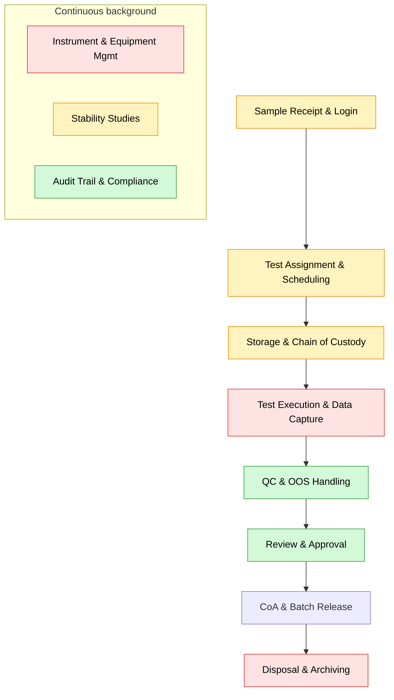
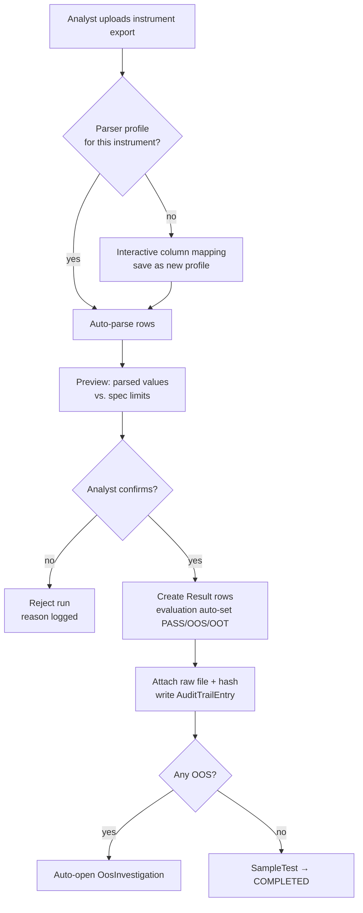
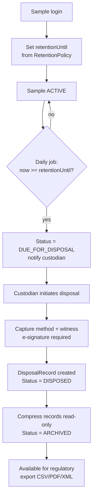
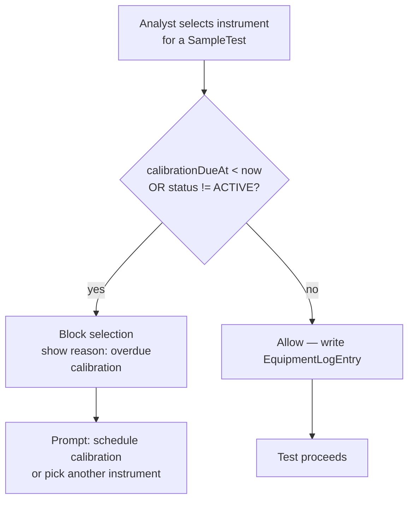
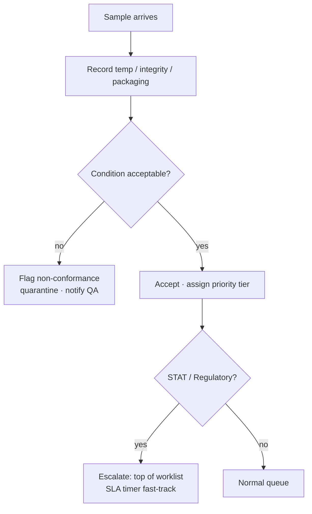
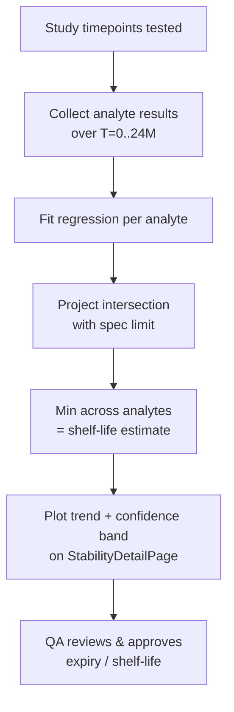
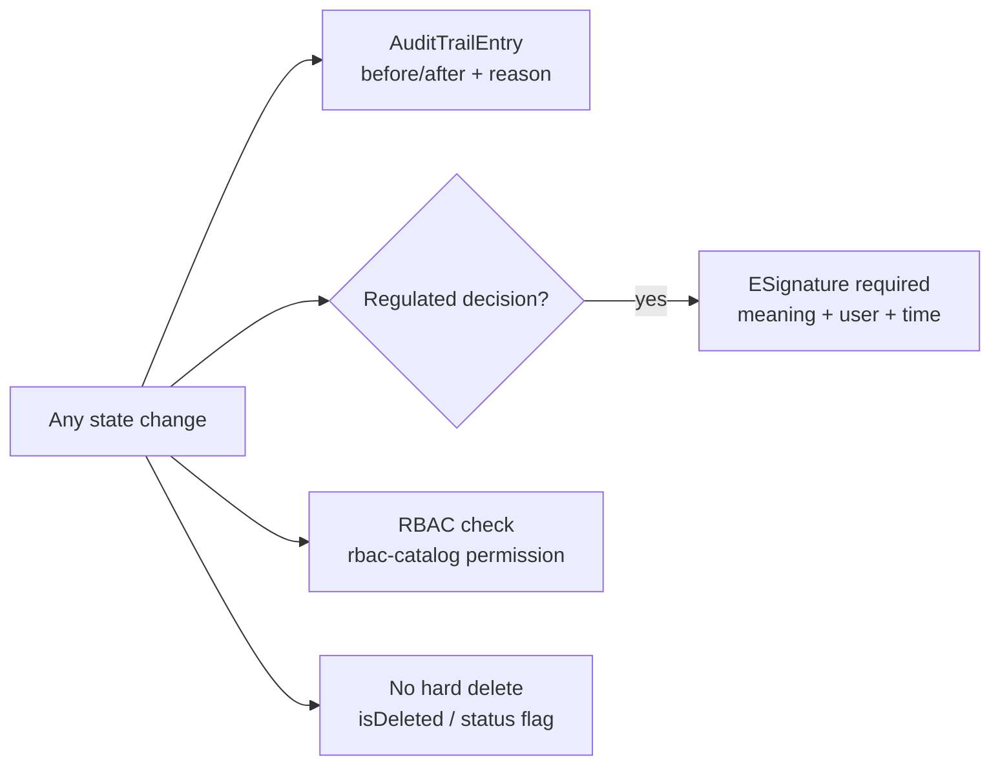
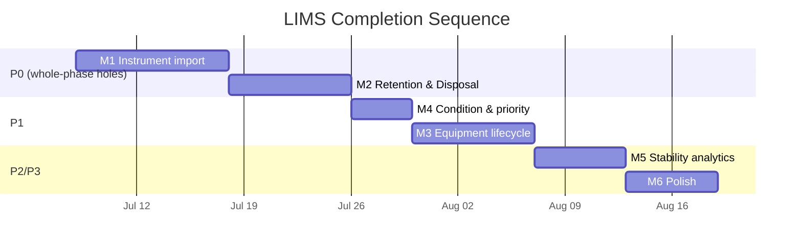

# LIMS Completion — Implementation Plan & Process Flows

> **Date:** 2026-07-07
> **Companion to:** `LIMS-gap-analysis.md`
> **Goal:** Close the 5 real gaps to reach a fully compliant, end-to-end LIMS.
> **Stack conventions:** Prisma model → `backend/src/modules/<name>/{schema,service,controller,routes}.ts`
> → `client/src/features/lims/<Page>.tsx`. Every state change writes an `AuditTrailEntry`;
> dispositions/approvals write an `ESignature`. Deletes use the shared `useConfirmDelete` modal.
> Database: **`kaizen_qms`** (never touch legacy `quantumkaizen`).

Flowcharts below use Mermaid — they render in GitHub, VS Code (Markdown Preview Mermaid
Support), and most doc viewers.

---

## 0. Where these gaps sit in the end-to-end LIMS flow



**Red = gap targeted by this plan · Yellow = partial · Green = already complete.**

---

## Milestone roadmap

| # | Milestone | Gap closed | Effort | Priority |
|---|-----------|-----------|:------:|:--------:|
| M1 | Instrument data import (file → results) | Phase 4 | L | 🔴 P0 |
| M2 | Retention & Disposal & Archiving | Phase 11 | M | 🔴 P0 |
| M3 | Equipment lifecycle (PM, IQ/OQ/PQ, auto-lock, logbook) | Phase 8 | M | 🟠 P1 |
| M4 | Sample condition check + priority tiers | Phase 1 | S | 🟠 P1 |
| M5 | Stability shelf-life analytics | Phase 9 | S–M | 🟡 P2 |
| M6 | Polish (cal-gate, slot booking, compendial lib, CoA email) | Phases 2/7/10 | S each | 🟡 P3 |

Recommended order: **M1 → M2 → M4 → M3 → M5 → M6** (M4 before M3 because it is small and
high-visibility; M1/M2 first because they are whole-phase holes).

---

## M1 — Instrument Data Import (Phase 4) 🔴

Turn `instrumentId` from a label into a real data path: upload an instrument export
(CSV/Excel/PDF-with-table), map columns to analytes, and create `Result` rows automatically —
eliminating manual transcription (the ALCOA+ win).

### Schema delta
```prisma
model InstrumentRun {
  id             String   @id @default(uuid())
  code           String   @unique
  instrumentId   String
  instrument     Equipment @relation(fields: [instrumentId], references: [id])
  worklistId     String?
  sampleTestId   String?
  fileName       String
  fileHash       String            // integrity: dedupe + tamper check
  rawStoragePath String            // original file retained (raw data)
  status         String   @default("UPLOADED") // UPLOADED | PARSED | MAPPED | POSTED | REJECTED
  parsedJson     String?           // extracted rows before mapping
  mappingJson    String?           // column → analyte mapping used
  postedById     String?
  postedAt       DateTime?
  createdById    String?
  createdAt      DateTime @default(now())
}

model InstrumentParserProfile {   // per instrument model: how to read its export
  id           String @id @default(uuid())
  instrumentId String?
  format       String            // CSV | XLSX | TXT
  delimiter    String?
  headerRow    Int    @default(1)
  columnMap    String            // JSON: { "Peak Area": "assay", ... }
  isActive     Boolean @default(true)
}
```
Add relation `InstrumentRun[]` to `Equipment`. Keep the **raw file** (`rawStoragePath` +
`fileHash`) forever — that is the raw data of record.

### Flow


### Build checklist
- [ ] `backend/src/modules/instrument-run/` — schema, service (parse + map + post), controller, routes.
- [ ] File upload via `multer`; add `csv-parse` and `xlsx` deps.
- [ ] Reuse existing spec-evaluation helper from `sample-testing.service.ts` for PASS/OOS/OOT.
- [ ] Auto-open OOS on any out-of-spec row (reuse `oos.service`).
- [ ] Frontend: `InstrumentRunUploadPage.tsx` + mapping modal + preview table.
- [ ] RBAC entries in `rbac-catalog.ts` (`instrument_run:upload`, `:post`).

> **Note on "full bidirectional":** true LES/middleware (LIMS pushes the order, instrument
> returns the result) is a later phase — it needs on-prem connectors per instrument vendor.
> File import delivers ~80% of the value with none of the on-prem footprint.

---

## M2 — Retention, Disposal & Archiving (Phase 11) 🔴

The only entirely-missing phase. Add a retention clock, a witnessed disposal workflow, and a
read-only archive.

### Schema delta
```prisma
// on Sample:
retentionUntil   DateTime?
retentionPolicy  String?          // e.g. "5y batch record"
disposalStatus   String  @default("ACTIVE") // ACTIVE | DUE_FOR_DISPOSAL | DISPOSED | ARCHIVED

model DisposalRecord {
  id           String   @id @default(uuid())
  sampleId     String
  sample       Sample   @relation(fields: [sampleId], references: [id])
  method       String            // Incineration | Autoclave | Return-to-supplier | ...
  disposedById String
  disposedAt   DateTime @default(now())
  witnessedBy  String?
  remarks      String?
  eSignatureId String?           // links to ESignature
}

model RetentionPolicy {
  id            String @id @default(uuid())
  sampleType    String            // Raw Material | Finished Product | Stability | ...
  retentionDays Int
  isActive      Boolean @default(true)
}
```
On sample login, set `retentionUntil = receivedAt + policy.retentionDays`. A daily job flips
`ACTIVE → DUE_FOR_DISPOSAL` when `now >= retentionUntil`.

### Flow


### Build checklist
- [ ] Schema deltas + migration on `kaizen_qms`.
- [ ] `backend/src/jobs/retention-sweep.job.ts` (daily cron; codebase already has a `jobs/` dir).
- [ ] `backend/src/modules/disposal/` module; e-signature enforced on disposal.
- [ ] Frontend: `DisposalQueuePage.tsx` (DUE list), disposal modal, disposal record on `SampleDetailPage`.
- [ ] Archive export endpoint (CSV/PDF/XML) reusing CoA/report renderers.

---

## M3 — Equipment Lifecycle (Phase 8) 🟠

Extend equipment beyond calibration: preventive maintenance, IQ/OQ/PQ qualification,
out-of-calibration auto-lock, and a usage logbook.

### Schema delta
```prisma
model MaintenanceSchedule {
  id             String @id @default(uuid())
  equipmentId    String
  equipment      Equipment @relation(fields: [equipmentId], references: [id])
  type           String            // PREVENTIVE | CORRECTIVE
  frequencyDays  Int
  lastPerformedAt DateTime?
  nextDueAt      DateTime?
}

model QualificationRecord {   // IQ / OQ / PQ
  id           String @id @default(uuid())
  equipmentId  String
  equipment    Equipment @relation(fields: [equipmentId], references: [id])
  kind         String            // IQ | OQ | PQ
  performedAt  DateTime
  documentId   String?           // link to DMS Document
  result       String            // PASS | FAIL
  nextDueAt    DateTime?
}

model EquipmentLogEntry {
  id           String @id @default(uuid())
  equipmentId  String
  usedById     String?
  usedFor      String?           // sampleTestId / worklistId
  startedAt    DateTime
  endedAt      DateTime?
  remarks      String?
}
// Equipment.status gains: OUT_OF_CALIBRATION, UNDER_MAINTENANCE (EquipmentStatus enum)
```

### Out-of-calibration auto-lock


### Build checklist
- [ ] Schema deltas + `EquipmentStatus` enum values.
- [ ] Validation guard in `sample-testing.service.ts` + `qc.service.ts` on instrument selection.
- [ ] Daily job flips equipment to `OUT_OF_CALIBRATION` when overdue.
- [ ] Frontend: PM/qualification/logbook tabs on `EquipmentDetailPage.tsx`.

---

## M4 — Sample Condition Check + Priority Tiers (Phase 1) 🟠

Small, high-visibility. Capture receipt condition and richer priority.

### Schema delta
```prisma
// on Sample:
conditionOk        Boolean?          // acceptance decision at login
receivedTempC      Float?
integrityOk        Boolean?
packagingCompliant Boolean?
conditionRemarks   String?
// priority widened → Low | Normal | High | Urgent | STAT | Regulatory
```

### Flow


### Build checklist
- [ ] Schema deltas + migration.
- [ ] Extend sample login form (`SampleListPage` create modal) with condition fields.
- [ ] On rejected condition, raise a NonConformance (reuse `audit`/`oos` linkage).
- [ ] Priority sort + badge on `SampleListPage`; wire STAT/Regulatory into SLA policy.

---

## M5 — Stability Shelf-Life Analytics (Phase 9) 🟡

Data is already collected per timepoint; add the analytics layer.

### Approach (no schema change required for v1)
- Aggregate `Result`s across a study's `StabilityPull`s per analyte over time.
- Linear (and optional log/quadratic) regression → project when the analyte crosses its spec
  limit → estimated shelf-life / expiry (ICH Q1E style).
- Persist the computed estimate on `StabilityStudy` (add `estimatedShelfLifeMonths`,
  `shelfLifeModelJson`).

### Flow


### Build checklist
- [ ] `stability-analytics.service.ts` — regression + projection.
- [ ] Trend chart on `StabilityDetailPage.tsx` (reuse `QcChartPage` charting).
- [ ] Store computed estimate; e-sign approval of shelf-life.

---

## M6 — Polish (Phases 2 / 7 / 10) 🟡

| Item | Where | Sketch |
|------|-------|--------|
| Reagent/standard cal-gate before scheduling | `sample-testing.service` | Reject scheduling if bound reagent/standard is expired/uncalibrated |
| Instrument slot booking | new `InstrumentBooking` model | Calendar of instrument time slots; prevent double-booking |
| Compendial method library (USP/BP/IP) | seed + `TestMethod` | Ship a starter library; tag methods by pharmacopoeia |
| Scheduled CoA email distribution | `coa.service` + job | On issue, email CoA PDF to `Customer` contacts; log distribution |

---

## Cross-cutting requirements (apply to every milestone)



- **Audit trail** on create/update/transition/sign/delete.
- **E-signatures** on disposal, shelf-life approval, result posting, batch release.
- **RBAC**: add every new action to `backend/src/lib/rbac-catalog.ts`.
- **Migrations** run against `kaizen_qms` only.
- **Deletes** use the shared `useConfirmDelete` Antd modal — never native `confirm()`.
- **No auto-commits** — changes stay in the working tree for review.

---

## Suggested sequencing (Gantt view)



*Durations are indicative single-developer estimates; parallelize M4 with M1/M2 if capacity allows.*
